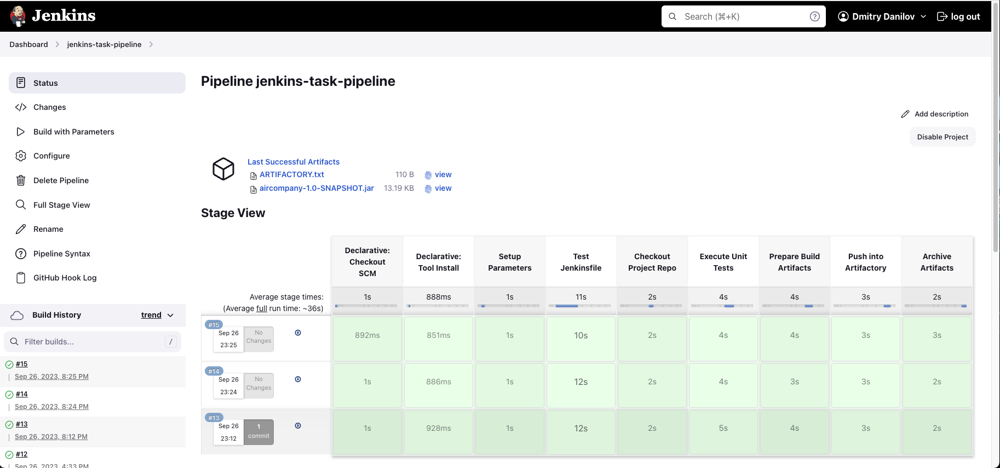

# Jenkins Task

### 1. Install and Run Jenkins With Docker Compose
#### Install Jenkins by Docker Compose
```
docker-compose -f jenkins-docker-compose.yml up
```
```
docker-compose -f jenkins-docker-compose.yml down
```
#### Login and Install Json Plugins
Additional Json Plugins
* Artifactory Plugin
* Git plugin
* GitHub plugin
* Gradle Plugin
* Maven Integration plugin
* Pipeline

#### Install Jenkins with Agent by Docker Compose
```
docker-compose -f jenkins-agent-docker-compose.yml up
```
```
docker-compose -f jenkins-agent-docker-compose.yml down
```
SSH generate
```
ssh-keygen -t rsa -f jenkins_agent
```
#### Change in the node configuration:
Remote Root Directory: `/home/jenkins/agent`
host: `agent`
Java Path: `/opt/java/openjdk/bin/java`


### 2. Jenkins Pipeline Settings
* Create Jenkins Pipeline
* Pipeline Settings


* Automatically run build on code commit
    * Configuring Jenkins (Manage Jenkins > Configure > System Advanced > Check 'Specify another hook url' > Copy this UR)
    * Configuring GitHub Repository (add Webhook in the repository Settings)
    * Configuring Jenkins Pipeline (Project configuration > Build Triggers > Github hook trigger for GITScm Polling)

### 3. Artifactory Settings


### 4. Jenkins Pipeline Run


### 5. Composition of the project
* Jenkinsfile
