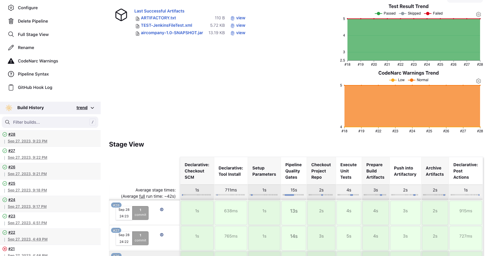
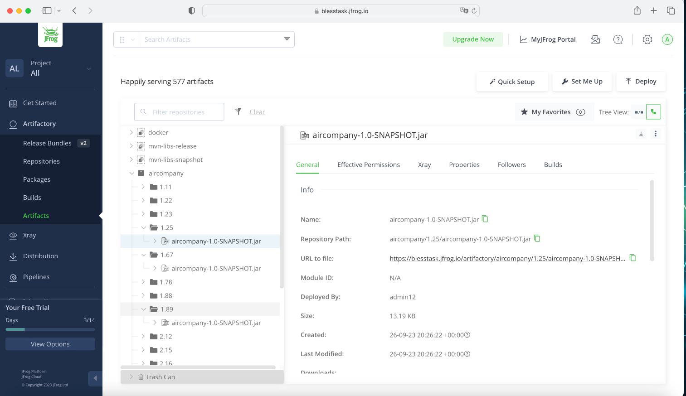

# Jenkins Task

## Description
### Composition of the project
1. Docker with Docker Compose
2. Jenkins
   - Jenkins Master
   - Jenkins Agent
   - Jenkins Pipeline
3. Project [jenkins-task](https://github.com/dzmitrydan/jenkins-task) (working project)
   - Build tool: [Gradle](https://gradle.org)
   - JenkinsPipelineUnit tests: [Groovy](https://groovy-lang.org) and [JUnit](https://junit.org/junit4)
   - Static code analyzer: [CodeNarc](https://codenarc.org)
   - Jenkinsfile
   - Docker-compose files
4. Project for pipeline [aircompany](https://github.com/dzmitrydan/aircompany)
5. Artifactory (cloud, trial)

##### Precondition
- Docker with components is installed

### 1. Install and Run Jenkins With Docker Compose
#### Install Jenkins by Docker Compose
Run Docker Compose:
```
docker-compose -f jenkins-docker-compose.yml up
```
Stop Docker Compose:
```
docker-compose -f jenkins-docker-compose.yml down
```
Open bash shell of docker container:
```
docker exec -it jenkins bash
```
#### Login and install suggested Jenkins plugins
#### Install additional Jenkins Plugins
- Artifactory Plugin
- Warnings Next Generation Plugin

#### Install Jenkins with Agent by Docker Compose
Run Docker Compose:
```
docker-compose -f jenkins-agent-docker-compose.yml up
```
Stop Docker Compose:
```
docker-compose -f jenkins-agent-docker-compose.yml down
```

#### Generate SSH keys (public, private)
```
ssh-keygen -t rsa -f jenkins_agent
```

#### In the Jenkins settings (Global credentials) add private SSH keys
- SSH `Username with private key`
- ID: `jenkins_agent`
- Username: `jenkins`
- Enter private SSH key`

#### Node settings:
- Remote Root Directory: `/home/jenkins/agent`
- Host: `agent`
- Launch method: `Launch agents via SSH`
- Credentials: select created
- Host Key Verification Strategy: `Non verifying Verification Strategy`
- Advanced
  - Java Path: `/opt/java/openjdk/bin/java`; 
  - Connection Timeout Seconds: `60`; 
  - Max Number of Retries: `10`; 
  - Seconds To Wait Between Retries: `10`; 
  - Use TCP_NODELAY flag on the SSH connection: check
  


### 2. Jenkins Pipeline Settings
- Project is parametrized. The parameter `VERSION` is passed for the directory in the Artifactory.
- Definition: `Pipeline script`
- SCM: `Git`
- Repository URL: project `jenkins-task` url
- Branch Specified: `*/main`

The `VERSION` with the artifact uploaded to the Artifactory is putted in the `ARTIFACTORY.txt` in the Archive Artifacts.

Jenkins dashboard
- This chart **Test Result Trend** shows the result of passing Unit tests
- This chart **CodeNarc Warnings Trend** shows the result CodeNarc check




##### Trigger a Jenkins build on Git commit
- Configuring Jenkins (Manage Jenkins > Configure > System Advanced > Check 'Specify another hook url' > Copy this UR)
- Configuring GitHub Repository (add Webhook in the repository Settings)
- Configuring Jenkins Pipeline (Project configuration > Build Triggers > Github hook trigger for GITScm Polling)

### 3. Artifactory
Аor the project was used cloud version (14-Day Trial)
Jenkins settings fo Artifactory (System > JFrog)
- JFrog Platform Instances
- Instance ID: artifactory
- JFrog Platform URL: https://blesstask.jfrog.io
- Username: username `for Artifactory`
- Password: password `for Artifactory`




